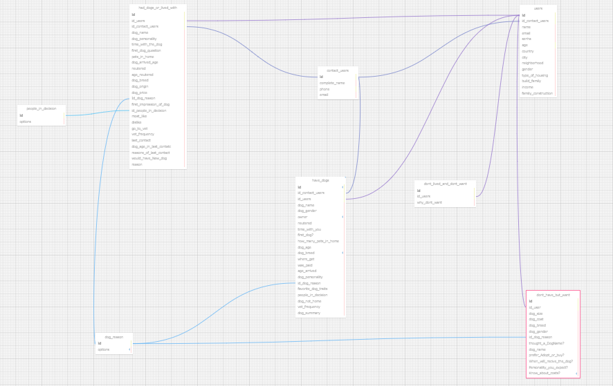

## Documentação Simplificada do Modelo Relacional

**Projeto:** Abandono Zero

**Data:** 2024-05-10

**Autor:** Vinícius Gomes Ibiapina

**Objetivo:** Descrever o modelo relacional do projeto de forma resumida e simplificada.

&nbsp;&nbsp;&nbsp;&nbsp; O Modelo relacional constitui em uma abordagem fundamental na representação e organização de dados, fornecendo uma perspectiva estrutural e relacional que facilita a descrição das informações. Essa estruturação essencial elimina a necessidade de estruturas adicionais complexas para representar os dados, promovendo assim uma independência dos dados em relação às aplicações que os manipulam.

  
 <b>Figura 1:</b> - Banco de dados

 
<b>Fonte:</b> Material elaborado pelo autor (2024)

## Entidades

&nbsp;&nbsp;&nbsp;&nbsp; Tabela <b>'users'</b>: Esta tabela armazena informações sobre os usuários do sistema.

 Campos:
  <ul>
    <li><b>'id'</b>: Identificador único do usuário ( <b><u>Primary Key</u></b> ). </li>
    <li><b>'name'</b>: Nome do usuário. <b><u>Dataype</u></b>: <b>varchar</b> </li>
    <li><b>'email'</b>: Endereço de e-mail do usuário. <b><u>Dataype</u></b>: <b>varchar</b> </li>
    <li><b>'senha'</b>: Senha do usuário. <b><u>Dataype</u></b>: <b>varchar</b> </li>
    <li><b>'age'</b>: Idade do usuário. <b><u>Dataype</u></b>: <b>integer</b> </li>
    <li><b>'country'</b>: País onde reside o usuário. <b><u>Dataype</u></b>: <b>varchar</b> </li>
    <li><b>'city'</b>: Cidade onde reside o usuário. <b><u>Dataype</u></b>: <b>varchar</b> </li>
    <li><b>'neighborhood'</b>: Bairro onde reside o usuário. <b><u>Dataype</u></b>: <b>varchar</b> </li>
    <li><b>'gender'</b>: Gênero do usuário. <b><u>Dataype</u></b>: <b>varchar</b> </li>
    <li><b>'type_of_housing'</b>: Tipo de residência do usuário.<b><u> Dataype</u></b>: <b>varchar</b> </li>
    <li><b>'build_family'</b>: Estrutura familiar do usuário.<b><u> Dataype</u></b>: <b>varchar</b> </li>
    <li><b>'income'</b>: Renda do usuário. <b><u>Dataype</u></b>: <b>varchar</b> </li>
    <li><b>'family_construction'</b>: Número de pessoas na residência do usuário. <b><u>Dataype</u></b>: <b>varchar</b> </li>
    </ul>

 &nbsp;&nbsp;&nbsp;&nbsp; Tabela <b>'contact_a_users'</b>: Esta tabela armazena informações de contato adicionais dos usuários.

 Campos:
 <ul>
    <li><b>'id'</b>: Identificador único de contato.  </li>
    <li><b>'id_users'</b>: <b><u>Foreign key</u></b> que refere o usuário na tabela <b>'users'</b>. </li>
    <li><b>'complete_name'</b>: Nome completo de contato. <b><u>Dataype</u></b>: <b>varchar</b> </li>
    <li><b>'phone'</b>: Número de telefone de contato. <b><u>Dataype</u></b>: <b>integer</b> </li>
    <li><b>'email'</b>: Endereço de e-mail de contato. <b><u>Dataype</u></b>: <b>varchar</b> </li>
  </ul>

  &nbsp;&nbsp;&nbsp;&nbsp; Tabela <b>'have_dogs'</b>: Esta tabela armazena informações sobre os usuários que possuem cachorros.

  Campos:
  <ul>
    <li><b>'id'</b>: Identificador unico do registro ( <b><u>Primary key</u></b> ). </li>
    <li><b>'id_users'</b>: Chave estrangeira que refere ao usuário na tabela <b>'users'</b>. </li>
    <li><b>'dog_name'</b>: Nome do cachorro. <b><u>Dataype</u></b>: <b>varchar</b></li>
    <li><b>'sex'</b>: Sexo do cachorro. <b><u>Dataype</u></b>: <b>Binary</b> </li>
    <li><b>'owner'</b>: Se o usuário é o dono do cachorro. <b><u>Dataype</u></b>: <b>binary</b></li>
    <li><b>'neutred'</b>: Se o cachorro foi castrado. <b><u>Dataype</u></b>: <b>binary</b> </li>
    <li><b>'time_with_you'</b>: Tempo que o cachorro está com o usuário. <b><u>Dataype</u></b>: <b>varchar</b> </li>
    <li><b>'first_dog?'</b>: Se é o primeiro cachorro do usuário. <b><u>Dataype</u></b>: <b>binary</b> </li>
    <li><b>'how_many_pets_in_home'</b>: Quantidade de animais de estimação na casa do usuário. <b><u>Dataype</u></b>: <b>varchar</b> </li>
    <li><b>'dog_age'</b>: Idade do cachorro. <b><u>Dataype</u></b>: <b>varchar</b> </li>
    <li><b>'dog_breed'</b>: Raça do cachorro. <b><u>Dataype</u></b>: <b>varchar</b> </li>
    <li><b>'where_get'</b>: De onde o usuário obteve o cachorro. <b><u>Dataype</u></b>: <b>varchar</b> </li>
    <li><b>'was_paid'</b>: Se o usuário pagou pelo cachorro. <b><u>Dataype</u></b>: <b>binary</b> </li>
    <li><b>'age_arrived'</b>: Idade em que o cachorro chegou. <b><u>Dataype</u></b>: <b>varchar</b> </li>
    <li><b>'dog_personality'</b>: Personalidade do cachorro. <b><u>Dataype</u></b>: <b>text</b> </li>
    <li><b>'id_dog_reason'</b>: Motivo pelo qual o usuário tem um cachorro ( referência a tabela <b>'dog_reason'</b> ). <b><u>Dataype</u></b>: <b>text</b> </li>
    <li><b>'favorite_dog_traits'</b>: Características favoritas do cachorro. <b><u>Dataype</u></b>: <b>text</b> </li>
    <li><b>'poeple_in_decision'</b>: Pessoas envolvidas na decisão de ter um cachorro. <b><u>Dataype</u></b>: <b>varchar</b> </li>
    <li><b>'dog_not_home'</b>: Se teve um cachorro que não pode manter em casa. <b><u>Dataype</u></b>: <b>text</b> </li>
    <li><b>'ver_frequency</b>: Frequência de visitas ao veterinário. <b><u>Dataype</u></b>: <b>varchar</b> </li>
    <li><b>'dog_summary'</b>: Resumo sobre o cachorro. <b><u>Dataype</u></b>: <b>text</b> </li>
  </ul>

  &nbsp;&nbsp;&nbsp;&nbsp; Tabela <b>'dog_reason'</b>: Esta tabela armazena os motivos pelos quais os usuários possuêm cachorros.

  Campos:
  <ul>
    <li><b>'id'</b>: Identificador único do motivo ( <b>Primary key</b> ). </li>
    <li><b>'options'</b>: Opções de motivos. O usuário pode escolher uma ou mais das opções a seguir: 

 a. Companhia para criança  
b. Acompanhamento para adulto(s)   
c. Por sua aparência 
d. Companhia para um cachorro que já mora na casa 
e. Ensinar responsabilidade às crianças  
f. Porque amigos já tinham  
g. Para proteção da residência, de pessoas.  
h. Para ajudar um amigo/conhecido que não conseguiu ficar com o cachorro  
i. Para salvar sua vida  
j. Ele/ela era fofo e estava disponível ou foi um encantamento imediato.  
k. Ele me escolheu  
l. Ele/ela foi um presente 

</li>
  </ul>

  &nbsp;&nbsp;&nbsp;&nbsp; Tabela <b>'had_dogs_or_lived_with'</b>: Esta tabela armazena informações sobre usuários que tiveram cachorros ou viveram com eles.

  Campos:
  <ul>
    <li><b>'id'</b>: Identificador único para cada registro de posse anterior de cães ou convivência com cães. ( <b><u>Primary key </u></b> ). </li>
    <li><b>'id_users'</b>: <b><u>Foreign key</u></b> referenciando a tabela <b>'users'</b> para estabelecer a relação com um usuário. </li>
    <li><b>'id_contact_users'</b>: <b><u>Foreign key</u></b> referenciando a tabela 
    <li><b>'dog_name'</b>: Nome do cachorro. <b><u>Dataype</u></b>: <b>varchar</b> </li>
    <li><b>'dog_personality'</b>: Personalidade do cachorro. <b><u>Dataype</u></b>: <b>text</b> </li>
    <li><b>'time_with_the_dog'</b>: Tempo que o usuário conviveu com o cachorro. <b><u>Dataype</u></b>: <b>varchar</b> </li>
    <li><b>'first_dog_question'</b>: Se era o primeiro cachorro do usuário. <b><u>Dataype</u></b>: <b>binary</b> </li>
    <li><b>'pets_in_home'</b>: Número de animais de estimação na casa do usuário. <b><u>Dataype</u></b>: <b>varchar</b> </li>
    <li><b>'dog_arrived_age'</b>: Idade em que o cachorro chegou na residência. <b><u>Dataype</u></b>: <b>varchar</b> </li>
    <li><b>'neutered'</b>: Se o cachorro foi castrado. <b><u>Dataype</u></b>: <b>binary</b> </li>
    <li><b>'age_neutered'</b>: Idade na qual o cachorro foi castrado. <b><u>Dataype</u></b>: <b>varchar</b> </li>
    <li><b>'dog_breed'</b>: Raça do cachorro. <b><u>Dataype</u></b>: <b>varchar</b> </li>
    <li><b>'dog_origin'</b>: Oirgem do cachorro. <b><u>Dataype</u></b>: <b>varchar</b> </li>
    <li><b>'dog_price'</b>: Preço do cachorro. <b><u>Dataype</u></b>: <b>varchar</b> </li>
    <li><b>'id_dog_reason'</b>: <b><u>Foreign key</u></b> referenciando a tabela <b>'dog_reason'</b> para estabelecer a razão da posse do cão. <b><u>Dataype</u></b>: <b>text</b> </li>
    <li><b>'first_impression_of_dog'</b>: Primeira impressão sobre o cachorro. <b><u>Dataype</u></b>: <b>text</b> </li>
    <li><b>'id_people_in_decision'</b>: <b><u>Foreign key</u></b> referenciando a tabela <b>'people_in_decision'</b> para estabelecer pessoas envolvidas na decisão de obter um cachorro. <b><u>Dataype</u></b>: <b>varchar</b> </li>
    <li><b>'most_like'</b>: Aspectos positivos do cão. <b><u>Dataype</u></b>: <b>text</b></li>
    <li><b>'deslike'</b>: Aspectos negativos do cachorro. <b><u>Dataype</u></b>: <b>text</b> </li>
    <li><b>'go_to_vet'</b>: Se o cachorro foi ao veterinário. <b><u>Dataype</u></b>: <b>binary</b> </li>
    <li><b>'last_contact'</b>: Último contato. <b><u>Dataype</u></b>: <b>varchar</b></li>
    <li><b>'dog_age_in_last_contact'</b>: Idade do cachorro no último contato. <b><u>Dataype</u></b>: <b>varchar</b> </li>
    <li><b>'reasons_of_last_contact'</b>: Razões do último contato. <b><u>Dataype</u></b>: <b>varchar</b> </li>
    <li><b>'would_have_new_dog'</b>: Se o usuário teria um novo cachorro. <b><u>Dataype</u></b>: <b>binary</b> </li>
    <li><b>'reason'</b>: Razão para não ter ou não querer um cachorro. <b><u>Dataype</u></b>: <b>text</b> </li>
  </ul>

  &nbsp;&nbsp;&nbsp;&nbsp; Tabela <b>'dont_have_but_want'</b>: Esta tabela armazena informações de usuários que não possuem cachorros mas gostariam de possuir.

  Campos:
  <ul>
      <li><b>'id'</b>: Identificador único para cada registro de usuário que não tem, mas deseja ter um cão. ( <b><u>Primary key</u></b> ). </li>
      <li><b>'id_user'</b>: <b><u>Foreign key</u></b> referenciando a tabela <b>'users'</b> para estabelecer a relação com um usuário. </li>
      <li><b>'dog_size'</b>: Tamanho do cachorro desejado. <b><u>Dataype</u></b>: <b>varchar</b> </li>
      <li><b>'dog_coat'</b>: Tipo de pelagem do cão desejado. <b><u>Dataype</u></b>: <b>varchar</b></li>
      <li><b>'dog_breed'</b>: Raça do cachorro desejado. <b><u>Dataype</u></b>: <b>varchar</b> </li>
      <li><b>'dog_sex'</b>: Sexo do cachorro desejado. <b><u>Dataype</u></b>: <b>binary</b> </li>
      <li><b>'id_dog_reason'</b>: <b><u>Foreign key</u></b> referenciando a tabela <b>'dog_reason'</b> para estabelecer a razão do desejo de ter um cachorro. <b><u>Dataype</u></b>: <b>text</b> </li>
      <li><b>'thought a DogName?'</b>: Se o usuário já pensou em um nome para o cachorro. <b><u>Dataype</u></b>: <b>binary</b> </li>
      <li><b>'dog_name'</b>: Nome desejado para o cachorro. <b><u>Dataype</u></b>: <b>varchar</b> </li>
      <li><b>'prefer Adopt or buy?'</b>: Preferência por adoção ou compra de um cachorro. <b><u>Dataype</u></b>: <b>varchar</b> </li>
      <li><b>'When_will_recive_the_dog?'</b>: Quando o usuário receberá o cachorro. <b><u>Dataype</u></b>: <b>varchar</b> </li>
      <li><b>'Personality you expect?'</b>: Personalidade esperada para o cachorro. <b><u>Dataype</u></b>: <b>text</b> </li>
      <li><b>'Know_about_coasts?'</b>: Conhecimento sobre os custos relacionados aos cachorros. <b><u>Dataype</u></b>: <b>text</b> </li>
    
  </ul>

   &nbsp;&nbsp;&nbsp;&nbsp; Tabela <b>'dont_lived_and_dont_want'</b>: Esta tabela armazena informações de usuários que não possuiram e não querem cachorros.

  Campos:
   <ul>
      <li><b>'id'</b>: Identificador único para cada registro de usuário que nunca teve e não deseja ter um cachorro. ( <b><u>Chave primária</u></b> ). </li>
      <li><b>'id_users'</b>: <b><u>Foreign key</u></b> referenciando a tabela <b>'users'</b> para estabelecer a relação com um usuário.</li>
      <li><b>'why_dont_want'</b>: Razões pelas quais o usuário não deseja ter um cachorro. <b><u>Dataype</u></b>: <b>text</b></li>
   </ul>

   ## Regras de Negócio

- Todos os campos obrigatórios devem ser preenchidos.
- As informações devem ser consistentes entre os formulários.
- Os usuários não podem editar informações já salvas, exceto em casos específicos.
- As informações dos usuários são confidenciais.

## Considerações Finais

&nbsp;&nbsp;&nbsp;&nbsp; Portanto, ao utilizar o modelo relacional garantimos a integridade referencial, assegurando que as relações entre as entidades sejam consistentes. Esta coerência é essencial para evitar divergências e garantir a confiabilidade dos dados armazenados. Dessa forma, ao adotarmos este modelo, estamos investindo em uma base sólida para o nosso sistema de gerenciamento de dados, promovendo uma gestão eficaz e sustentável ao longo do tempo.

**Observações:**

- Este modelo é uma versão simplificada e pode ser adaptado às necessidades específicas do projeto.
- É importante documentar detalhadamente o modelo relacional para facilitar o entendimento e a manutenção do sistema.
- A implementação do modelo relacional deve seguir boas práticas de desenvolvimento de banco de dados.
